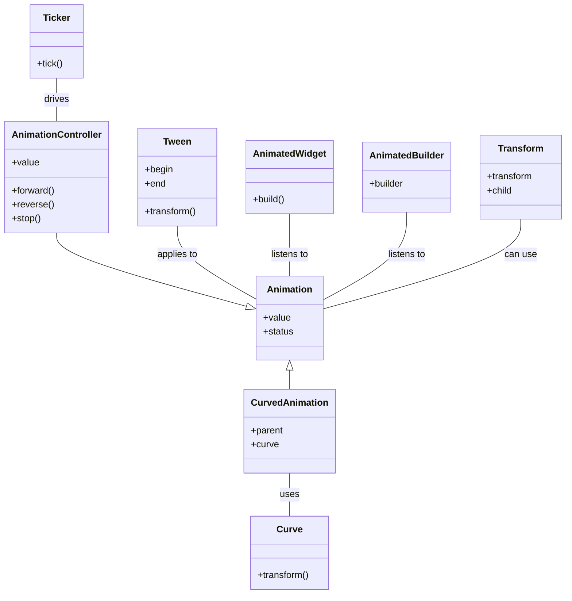

# Flutter 애니메이션 구성요소와 관계도 

1. "drives" (Ticker -- AnimationController):
   - Ticker가 AnimationController를 "구동"
   - Ticker는 vsync 신호에 따라 정기적으로 "틱(tick)"을 생성하여 AnimationController에 전달
   - 이 관계를 통해 AnimationController는 시간에 따른 애니메이션 진행을 제어 할 수 있음

2. "uses" (CurvedAnimation -- Curve):
   - CurvedAnimation이 Curve를 "사용
   - CurvedAnimation은 주어진 Curve 객체를 사용하여 선형 애니메이션 진행을 비선형으로 변환
   - 애니메이션에 가속, 감속 등의 효과를 줄 수 있음.

3. "applies to" (Tween -- Animation):
   - Tween이 Animation에 "적용"됨.
   - Tween은 Animation의 0.0에서 1.0 사이의 값을 원하는 범위나 타입의 값으로 변환.
   - 예를 들어, 0에서 100까지의 크기 변화나 한 색상에서 다른 색상으로의 변화를 정의할 수 있음.

4. "listens to" (AnimatedWidget -- Animation, AnimatedBuilder -- Animation):
   - AnimatedWidget과 AnimatedBuilder가 Animation을 "listen"
   - 이들은 Animation 객체의 값 변화를 감지하고, 값이 변경될 때마다 업데이트

5. "can use" (Transform -- Animation):
   - Transform이 Animation을 "사용할 수 있음".
   - Transform 위젯은 Animation 값을 사용하여 자식 위젯에 변형(예: 회전, 크기 조절, 이동)을 적용할 수 있음.

6. "inherits from" (AnimationController --|> Animation):
   - AnimationController가 Animation을 "상속".
   - AnimationController는 Animation<double>의 구체적인 구현체로, 애니메이션의 진행을 제어하는 기능을 추가로 제공.