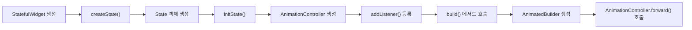
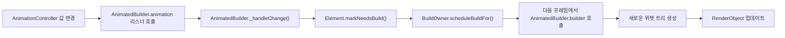
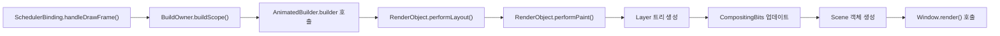

## 1. 애니메이션 초기화 및 시작

1. `StatefulWidget`이 생성되면 `createState()`를 호출하여 `State` 객체를 생성
2. `State` 객체의 `initState()` 메서드에서 `AnimationController`를 초기화
3. `AnimationController`에 리스너를 등록
4. 초기 `build()` 메서드가 호출되고, 여기서 `AnimatedBuilder`를 생성
5. 애니메이션을 시작하기 위해 `AnimationController.forward()`를 호출

## 2. AnimatedBuilder 동작 및 값 전달

1. `AnimationController`의 값이 변경되면 `AnimatedBuilder`의 `animation` 리스너가 호출
2. `AnimatedBuilder`는 내부적으로 `_handleChange()` 메서드를 호출
3. `Element.markNeedsBuild()`가 호출되어 해당 `Element`를 다시 빌드해야 함을 표시.
4. `BuildOwner.scheduleBuildFor()`가 호출되어 다음 프레임에서 빌드할 요소로 등록.
5. 다음 프레임에서 `AnimatedBuilder`의 `builder` 함수가 호출.
6. `builder` 함수는 현재 애니메이션 값을 사용하여 새로운 위젯 트리를 생성.
7. 생성된 위젯 트리에 따라 `RenderObject`가 업데이트.

## 3. 애니메이션 실행 및 프레임 처리

```mermaid
flowchart LR
    A["AnimationController.forward()"] --> B["SchedulerBinding.scheduleFrameCallback()"]
    B --> C["Vsync 신호 대기"]
    C --> D["SchedulerBinding._handleBeginFrame()"]
    D --> E["AnimationController._tick()"]
    E --> F["Animation 값 계산"]
    F --> G["AnimatedBuilder.animation 리스너 호출"]
    G --> H["AnimatedBuilder 리빌드"]
    H --> I["RenderObject.markNeedsLayout()"]
    I --> J["RenderObject.markNeedsPaint()"]
```

1. `AnimationController.forward()`가 호출되면 `SchedulerBinding.scheduleFrameCallback()`을 통해 다음 프레임을 예약.
2. Vsync 신호를 대기.
3. 신호가 오면 `SchedulerBinding._handleBeginFrame()`이 호출.
4. `AnimationController._tick()`이 호출되어 새로운 애니메이션 값을 계산.
5. 계산된 값으로 `AnimatedBuilder`의 `animation` 리스너가 호출.
6. `AnimatedBuilder`가 리빌드되어 새로운 위젯 트리를 생성.
7. 변경된 부분에 대해 `RenderObject`의 `markNeedsLayout()`과 `markNeedsPaint()`가 호출.

## 4. 레이아웃 및 페인팅

1. `SchedulerBinding.handleDrawFrame()`이 호출되어 프레임 그리기를 시작.
2. `BuildOwner.buildScope()`가 호출되어 필요한 위젯들을 리빌드.
3. `AnimatedBuilder`의 `builder` 함수가 호출되어 새로운 위젯 트리를 생성.
4. `RenderObject.performLayout()`이 호출되어 레이아웃을 계산.
5. `RenderObject.performPaint()`가 호출되어 페인팅 작업을 수행.
6. Layer 트리가 생성되고 CompositingBits가 업데이트.
7. 최종적으로 Scene 객체가 생성되고 `Window.render()`를 통해 화면에 출력.

