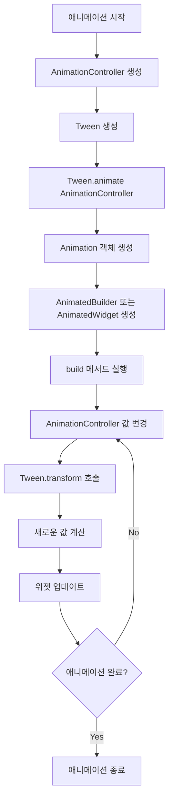

네, 이해했습니다. 문장을 명사로 끝맺음하여 더 깔끔하게 수정하겠습니다.

# Flutter 애니메이션에서의 Tween

Tween (Interpolation의 줄임말)은 Flutter 애니메이션에서 시작값과 끝값 사이의 중간값 계산 담당.

## Tween의 기본 개념

- Tween: 시작값(begin)과 끝값(end)의 정의.
- AnimationController의 0.0에서 1.0 사이 값을 원하는 범위의 값으로 매핑.
- 다양한 타입의 Tween 존재 (예: ColorTween, SizeTween 등).

## Tween이 Animation 빌드에 영향을 주는 과정



## 상세 설명

1. **애니메이션 시작**: 
   애니메이션 프로세스의 시작.

2. **AnimationController 생성**: 
   애니메이션 진행 제어를 위한 AnimationController 생성.

3. **Tween 생성**: 
   애니메이션의 시작값과 끝값 정의를 위한 Tween 생성.
   ```dart
   final Tween<double> _scaleTween = Tween<double>(begin: 1.0, end: 2.0);
   ```

4. **Tween.animate(AnimationController)**:
   Tween과 AnimationController 연결을 통한 Animation 객체 생성.
   ```dart
   final Animation<double> _animation = _scaleTween.animate(_controller);
   ```

5. **Animation 객체 생성**:
   Tween과 AnimationController 결합으로 인한 Animation 객체 생성.

6. **AnimatedBuilder 또는 AnimatedWidget 생성**:
   Animation 객체를 사용한 UI 업데이트 위젯 생성.

7. **build 메서드 실행**:
   위젯의 build 메서드 실행을 통한 초기 UI 구성.

8. **AnimationController 값 변경**:
   AnimationController에 의한 0.0에서 1.0 사이 값 생성.

9. **Tween.transform 호출**:
   AnimationController의 현재 값을 사용한 Tween의 transform 메서드 호출.

10. **새로운 값 계산**:
    현재 애니메이션 값에 해당하는 중간값의 Tween 계산.

11. **위젯 업데이트**:
    계산된 새 값을 사용한 위젯 업데이트.

12. **애니메이션 완료 확인**:
    애니메이션 완료 여부 확인.

13. **반복 또는 종료**:
    미완료 시 8번 단계로 회귀, 완료 시 애니메이션 종료.

## Tween의 중요성

Tween: 애니메이션 동작의 세밀한 제어 가능.

예시:
- 복잡한 색상 변화: `ColorTween`
- 크기 변화: `SizeTween`
- 텍스트 스타일 변화: `TextStyleTween`

Tween 사용의 이점: AnimationController의 선형적 0.0-1.0 값을 다양한 타입과 범위의 값으로 변환 가능. 결과적으로 더 풍부하고 다양한 애니메이션 생성 가능.